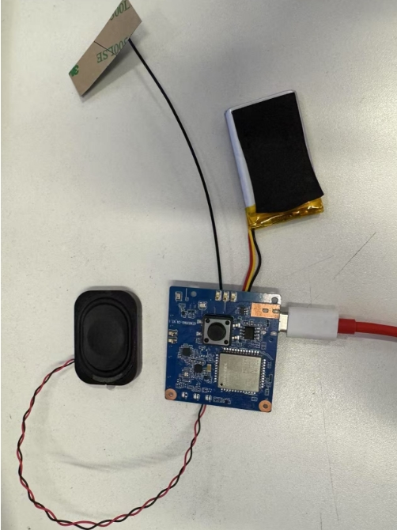
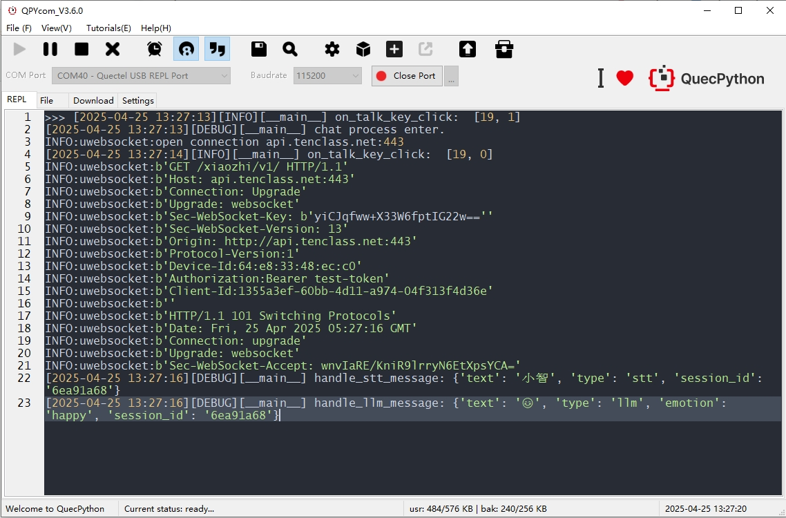

# QuecPython AI Chatbot Based on Xiaozhi Platform

## Table of Contents

- [Introduction](#Introduction)
- [Features](#Features)
- [Quick_Start](#Quick_Start)
  - [Prerequisites](#Prerequisites)
  - [Installation](#Installation)
  - [Running_Application](#Running_Application)
- [Contributing](#Contributing)
- [License](#License)
- [Support](#Support)

## Introduction

QuecPython introduces the Xiaozhi Platform AI Chatbot solution. This solution is based on the WebSocket protocol, offering cross-platform compatibility and supporting most QuecPython modules.

This demo uses an AI development board equipped with the EC800MCNLE module.

## Features

- Supports voice interruption/barge-in.
- Supports keyword-based voice wake-up.
- Uses Python for easy secondary development.

## Quick_Start

### Prerequisites

Before getting started, ensure you have the following prerequisites:

- **Hardware:**
  - Contact Quectel to obtain the AI development board and accessories.
  - Computer (Windows 7, Windows 10, or Windows 11)
  - Speaker
    - Any 2-5W speaker will work
    - [Purchase link from Quectel Mall](https://www.quecmall.com/goods-detail/2c90800c94028da201948249e9f4012d)
- **Software:**
  - Debugging tool [QPYcom](https://images.quectel.com/python/2022/12/QPYcom_V3.6.0.zip)
  - QuecPython firmware (beta firmware is available in the `fw` directory of the repository)
  - Python text editor (e.g., [VSCode](https://code.visualstudio.com/), [PyCharm](https://www.jetbrains.com/pycharm/download/))

### Installation

1. **Clone the Repository:**

   ```bash
   git clone https://github.com/QuecPython/solution-xiaozhiAI.git  
   ```

2. **Flash the Firmware:**
   Follow the [instructions](https://python.quectel.com/doc/Application_guide/zh/dev-tools/QPYcom/qpycom-dw.html#%E4%B8%8B%E8%BD%BD%E5%9B%BA%E4%BB%B6) to flash the firmware onto the development board.

### Running_Application

1. **Hardware Connection:**
   This demo uses the Quectel AI development board. Contact Quectel if needed. Connect the hardware as shown below:

   

   1. Connect the speaker
   2. Connect the antenna
   3. Insert the battery

2. Connect to the host computer via Type-C.

3. **Download the Code to the Device:**

   - Launch the QPYcom debugging tool.
   - Connect the data cable to the computer.
   - Press the **PWRKEY** button on the development board to power on the device.
   - Follow the [instructions](https://developer.quectel.com/doc/quecpython/Getting_started/en/4G/first_python.html#PC与模组间的文件传输) to import all files from the `code` folder into the module's file system, preserving the directory structure.

4. **Run the Application:**

   - Select the `File` tab.
   - Choose the `_main.py` script.
   - Right-click and select `Run` or use the `Run` shortcut button to execute the script.

5. **After keyword wake-up, start a conversation. Refer to the runtime log:**

   

6. For a usage example, refer to the demo video: `media/example_video.mp4`

## Contributing

We welcome contributions to improve this project! Follow these steps to contribute:

1. Fork this repository.
2. Create a new branch (`git checkout -b feature/your-feature`).
3. Commit your changes (`git commit -m 'Add your feature'`).
4. Push to the branch (`git push origin feature/your-feature`).
5. Open a Pull Request.

## License

This project is licensed under the Apache License. See the [LICENSE](https://license/) file for details.

## Support

If you have any questions or need support, refer to the [QuecPython Documentation](https://python.quectel.com/doc) or open an issue in this repository.
